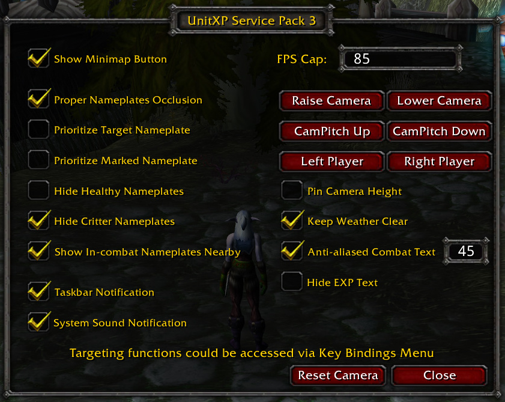

# UnitXP Service Pack 3

Making Vanilla 1.12 better:
- Nameplates would consider line of sight.
- Better targeting functions for your TAB key.
- Being able to adjust camera height/placement.
- In-game Frame-per-second limiter.
- Flash taskbar icon when receiving whisper.
- High quality floating combat texts.
- Screenshot generates JPEG instead of TGA.
- Step by step debugger for Lua addon.
- And more...

UnitXP Service Pack 3 (abbr. xp3) is a game mod for Vanilla 1.12 which aims to bring the game modern and better experience.

## Installation

- Downloads from https://codeberg.org/konaka/UnitXP_SP3/releases

To setup the DLL file:
1. Put all files under the same folder with the game
2. Edit your loader's list (which might be `dlls.txt`) to include `UnitXP_SP3.dll`
3. Start the game

To setup the Lua addon:
1. Move `UnitXP_SP3_Addon` folder into `Interface/AddOns/`
2. Then in-game there is a minimap button to open its config interface.

## UnitXP_SP3_Addon

When both the DLL and Lua addon are installed and loaded, there would be a minimap button to open up config interface.

Also the command `/unitxp` would open it either. Most functions could be configured here.

Targeting functions could be bound to keys via in-game `Key Bindings` menu.

## Additional Lua functions

### Line of sight

`local bool_abc = UnitXP("inSight", UNIT_ID_1, UNIT_ID_2);`

This would return TRUE if `UNIT_ID_1` is in sight of `UNIT_ID_2`.

In addition, `UNIT_ID_1` could be `camera` to check if `UNIT_ID_2` is in sight of camera.

### Distance

`local double_abc = UnitXP("distanceBetween", UNIT_ID_1, UNIT_ID_2);`

This would return the distance between `UNIT_ID_1` and `UNIT_ID_2`. The default meter is accurate for ranged spell like bolts or heals.

`local double_abc = UnitXP("distanceBetween", UNIT_ID_1, UNIT_ID_2, "AoE");`

The `AoE` meter is accurate for novas.

`local double_abc = UnitXP("distanceBetween", UNIT_ID_1, UNIT_ID_2, "meleeAutoAttack");`

The `meleeAutoAttack` meter is accurate for melee weapon swings. Beware that melee spell cast is not the same as melee weapon swings: Taunt has a different range than auto-attack.

### Behind

`local bool_abc = UnitXP("behind", UNIT_ID_1, UNIT_ID_2);`

This would return TRUE if `UNIT_ID_1` is behind `UNIT_ID_2`.

There are some strange mobs whose back is not the π radian half of its back. You could set the range smaller by `local back = UnitXP("behindThreshold", "set", 2);` The third parameter by default is π/2 and it ranges from `0 to π` the bigger of it, the smaller radian range would be judged as back.

### Timer

`local timer_id = UnitXP("timer", "arm", 1000, 2000, "callback_function_name");`

Arm a new timer which would trigger after 1000 milliseconds and would repeat every 2000 milliseconds to execute `callback_function_name`.

The callback is the function's name in string, not the actual Lua function.

The timer ID would be passed into callback function as 1st parameter.

You could pass 0 to parameter to stop repeating.

The xp3 timers run in a different thread from the game so that they would not cost game time to maintain. And they would trigger only when the time comes, rather than every frame.

`UnitXP("timer", "disarm", TIMER_ID);`

As xp3 timers are in a different thread, they would not be stopped when the game reload. Addon author needs to react to PLAYER_LOGOUT event and disarm running timers.

`local total = UnitXP("timer", "size");`

Return total count of running timers.

### OS notifications

`UnitXP("notify", "taskbarIcon");`

`UnitXP("notify", "systemSound");`

Trigger a taskbar icon flash or a sound alert in operating system. These functions only effective when the game is in background.

### Advanced Lua debugger

The xp3 provides a step by step debugger for in-game Lua. The debugger program is in `UnitXP_SP3-debug` packages.

To use the debugger:

1. Run `Demo Lua Debugger.exe`. It is a C# program which would work on Windows (via .NET framework) and Linux (via Mono).
2. In the Lua code, add a breakpoint as `UnitXP("debug", "breakpoint");`
3. Start the game and run the Lua code.

The xp3 would connect to debugger via TCP port 2323. Lua source preview requires `Demo Lua Debugger.exe` being placed in game's folder.

### Version and existence

To tell if xp3 is exist in the game:

`local xp3 = pcall(UnitXP, "nop", "nop");`

Returns TRUE for existing.

`local xp3exist, xp3buildTime = pcall(UnitXP, "version", "coffTimeDateStamp");`

`xp3buildTime` is the time when xp3 is compiled and built. It is a UNIX timestamp so that you could compare as number to tell which one is newer. 

`local xp3exist, xp3info = pcall(UnitXP, "version", "additionalInformation");`

`xp3info` is a string contains some description about the version. It meant to be used by different xp3 maintainer to distinguish bloodline. 

### Performance profile

`local performance = UnitXP("performanceProfile", "get");`

`performance` would be a string that shows performance factors of xp3.

### Targeting

These functions could be bound to keys via in-game Key Bindings menu. Also they could be called via Lua.

Most targeting functions follow rules:

- When there is no selected target, select the nearest enemy.
- Select enemies in line of sight of player character.
- Select enemies in front of camera. It is possbile to narrow the targeting cone to be smaller than camera sight by `UnitXP("target", "rangeCone", 2.5);` The third parameter ranges from `2.0 to infinate`, the bigger of it, the narrower targeting cone.
- The fartherest range (farRange) by default is 41, which could be adjusted in range `26 to 60` by `UnitXP("target", "farRange", 60);`.
- When the player is in-combat, only select enemies who is in-combat either. This limitation could be lifted by `UnitXP("target", "disableInCombatFilter");`.
- Totems, Pets and Critters would be ignored.
- Targeting functions return TRUE when they found a target, so that you could chain multiple functions.

`local found = UnitXP("target", "nearestEnemy");`

Target the nearest enemy. It is the only one, no cycling.

`local found = UnitXP("target", "mostHP");`

Target the enemy with most HP. It is the only one, no cycling.

`local found = UnitXP("target", "worldBoss");`

Cycling around world bosses.

`local found = UnitXP("target", "nextEnemyInCycle");`

`local found = UnitXP("target", "previousEnemyInCycle");`

Cycling around enemies. It is gurandteed that when repeatly trigger this function, all enemies in range would be selected for once.

Ranged class might prefer this function as TAB key.

`local found = UnitXP("target", "nextEnemyConsideringDistance");`

`local found = UnitXP("target", "previousEnemyConsideringDistance");`

Cycling around enemies. Enemies are classified into 3 range buckets `0 to 8`, `8 to 25`, `25 to farRange`. This function would give priority to enemies in the near bucket, so that when there is a targetable enemy in near bucket, the rest is ignored.

In `0 to 8` range the function cycling around all in-range enemies.

In `8 to 25` range the function cycling around 3 nearest in-range enemies.

In `25 to farRange` range the function cycling around 5 nearest in-range enemies.

`local found = UnitXP("target", "nextMarkedEnemyInCycle");`

`local found = UnitXP("target", "previousMarkedEnemyInCycle");`

Cycling around raid marked enemies. By default the order is:

- White Skull
- Red Cross (X)
- Blue Square
- White Moon
- Green Triangle
- Purple Diamond
- Orange Circle
- Yellow Star

You could supply a third parameter to reorder or limit to specific marks: 

`local found = UnitXP("target", "nextMarkedEnemyInCycle", "138");`  would cycle in order:

- Yellow Star which is [index 1](https://us.forums.blizzard.com/en/wow/t/macro-help-setting-raid-target-icons/319815/3)
- Purple Diamond which is [index 3](https://us.forums.blizzard.com/en/wow/t/macro-help-setting-raid-target-icons/319815/3)
- White Skull which is [index 8](https://us.forums.blizzard.com/en/wow/t/macro-help-setting-raid-target-icons/319815/3)

## Build Instructions
To build xp3, MSVC and clang compilers could be used. Note that GCC/MinGW would expect problems and are not supported.

### clang
There is a `Makefile` provided for cross-compiling xp3 on Linux with clang.

1. xp3 needs a working Windows SDK for **x86 (32 bits)**. To acquire Windows SDK on Linux please follow instructions at https://github.com/Jake-Shadle/xwin ( Note that it is fine to use a 64-bits xwin to acquire 32-bits SDK, so there is no need to compile xwin  ).
2. xp3 needs d3dx9 headers, which are no longer provided by modern Windows SDK. We could find those headers in [elder DirectX 9 SDK](https://www.microsoft.com/en-us/download/details.aspx?id=6812). Or maybe try [some other source](https://github.com/apitrace/dxsdk/tree/master/Include). Only those files start with `d3dx9*` are needed ( 11 in total ).
3. Edit `Makefile` to point `XWIN_ROOT` to Windows SDK and `D3DX_INCLUDES` to d3dx9 headers path.
4. Call `make` via command line.

### MSVC
As xp3 does not provide a MSVC project file, because of MSVC use different project format for every version, the user who is trying to build xp3 on MSVC could start a new blank C++ DLL project in her/his IDE.

1. xp3 should be built for **x86 (32 bits)**.
2. There are a few macro definitions need to be added into `Project Property -> C/C++ -> Preprocessor -> Preprocessor Definitions` which are `_WIN32`, `_X86_`, `WIN32_LEAN_AND_MEAN` and `NULL=0`.
3. xp3 is using C++ 17 features so that `Project Property -> C/C++ -> Language -> C++ Language Standard` needs to be set to `ISO C++ 17 Standard`.
4. `Project Property -> C/C++ -> Optimization -> Optimization` should be set to /Od or /O1. There is a strange phenomenon that /O2 in MSVC might result in running program, but clang /O2 would crash the game. MinHook is using /O1 for release and /Od for debug. It is suggested to use /O1 in xp3 for safe.
3. It is suggested to download a pre-built MinHook library from https://github.com/TsudaKageyu/minhook
4. xp3 needs d3dx9 headers, which are no longer provided by modern Windows SDK. We could find those headers in [elder DirectX 9 SDK](https://www.microsoft.com/en-us/download/details.aspx?id=6812). Or maybe try [some other source](https://github.com/apitrace/dxsdk/tree/master/Include). Only those files start with `d3dx9*` are needed ( 11 in total ).
5. Add additional include directory and additional linker dependency to MinHook.
6. Add additional include directory to d3dx9.
6. Build the project.